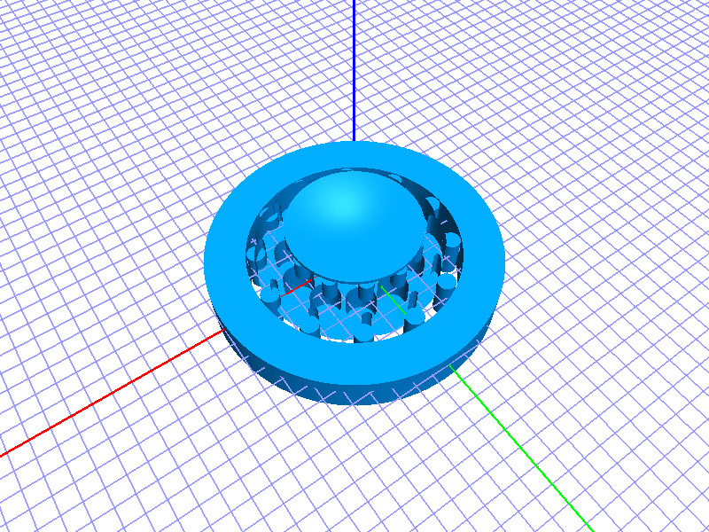
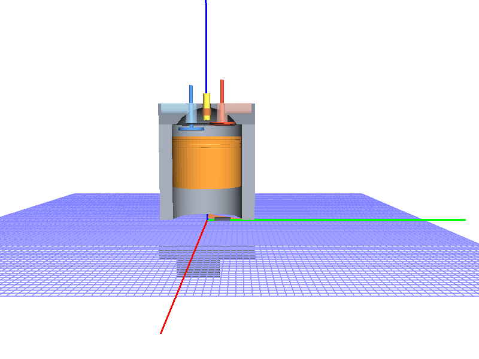
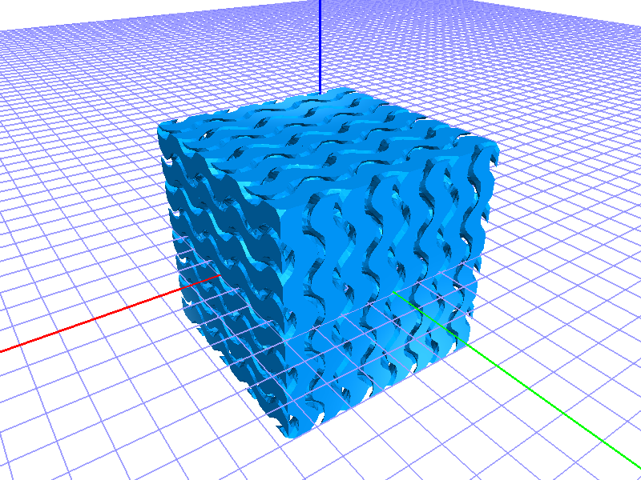
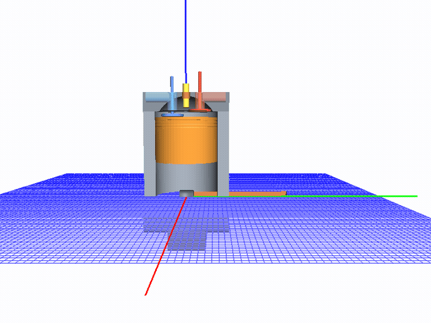

# jscad-mcp

An MCP server that gives Claude visual and structural awareness of OpenJSCAD models. Renders `.jscad` files to PNG using the OpenJSCAD geometry kernel and returns images directly into Claude's context — closing the perception loop so Claude can see what it builds.

A **live web viewer** runs alongside the server. Every render Claude produces is pushed to the viewer in real-time via SSE, so you always see exactly what Claude sees.

## Gallery

| Cycloidal drive | Engine cutaway | Gyroid lattice |
|---|---|---|
| [](https://github.com/caliperhq/jscad-mcp-example/blob/main/EXAMPLES.md#cycloidal-drive-reducer) | [](https://github.com/caliperhq/jscad-mcp-example/blob/main/EXAMPLES.md#cutaway-4-stroke-engine) | [](https://github.com/caliperhq/jscad-mcp-example/blob/main/EXAMPLES.md#gyroid-lattice-cube) |

Engine crank-angle sweep — 12 frames stepping `crankAngle` 0° → 330°:



Full walkthroughs, iteration GIFs, and "Try in browser" links to openjscad.xyz live in **[caliperhq/jscad-mcp-example](https://github.com/caliperhq/jscad-mcp-example)**.

## Requirements

- **Node 18–22 recommended** (Node 24 requires an extra step — see below)
- **Native build tools** (for headless-gl — no GPU needed, but native bindings are required):

```bash
# Debian / Ubuntu
apt install libxi-dev libxmu-dev libgl1-mesa-dev libglu1-mesa-dev build-essential

# Fedora / RHEL
dnf install libXi-devel libXmu-devel mesa-libGL-devel mesa-libGLU-devel

# Gentoo
emerge x11-libs/libXi x11-libs/libXmu media-libs/mesa

# macOS (via Homebrew)
xcode-select --install
```

## Installation

```bash
npm install -g jscad-mcp
```

Or run without installing:

```bash
npx jscad-mcp
```

### Node 24 note

headless-gl 6.x does not compile on Node 24 with GCC 14+ due to a missing `#include <cstdint>` in the ANGLE library. If you're on Node 24, either use [nvm](https://github.com/nvm-sh/nvm) to switch to Node 20 LTS for the install step, or manually build headless-gl after install:

```bash
npm install -g jscad-mcp
cd $(npm root -g)/jscad-mcp
# patch and rebuild gl:
sed -i 's/#include <vector>/#include <vector>\n#include <cstdint>/' node_modules/gl/angle/src/common/angleutils.h
npm rebuild gl
```

## Claude Desktop configuration

Add to your `claude_desktop_config.json`:

```json
{
  "mcpServers": {
    "jscad": {
      "command": "jscad-mcp",
      "args": []
    }
  }
}
```

If you installed locally (not globally), use the full path:

```json
{
  "mcpServers": {
    "jscad": {
      "command": "node",
      "args": ["/path/to/jscad-mcp/src/index.js"]
    }
  }
}
```

## Claude Code CLI configuration

```bash
claude mcp add --scope user jscad jscad-mcp
```

Or with a local clone:

```bash
claude mcp add --scope user jscad node /path/to/jscad-mcp/src/index.js
```

## Skills installation

Install the Claude Code skills for the best experience — they teach Claude the render-verify loop and full JSCAD API:

```bash
SKILLS_DIR="$HOME/.claude/skills"
mkdir -p "$SKILLS_DIR"
cp -r skills/jscad-mcp     "$SKILLS_DIR/"
cp -r skills/jscad          "$SKILLS_DIR/"
cp -r skills/jscad-wiki     "$SKILLS_DIR/"
cp -r skills/jscad-examples "$SKILLS_DIR/"
```

See [`skills/README.md`](skills/README.md) for details.

## MCP Tools

| Tool | Description |
|------|-------------|
| `take_standard_views` | Render iso, front, side, and top in one call |
| `take_image` | Render from a specific azimuth, elevation, zoom, and target |
| `slice` | Cross-section view: cut along x/y/z plane, camera auto-oriented |
| `list_parts` | List named parts with bounding boxes |
| `highlight` | Render with one named part lit up, rest faded |
| `label_parts` | Render with a legend mapping part names to screen positions |
| `open_viewer` | Open the web viewer in the default browser |
| `echo` | Verify the MCP connection |
| `render_test` | Confirm the render pipeline works (no input needed) |

All tools accept either `file` (absolute path to a `.jscad`) or `code` (inline JSCAD source). `take_image` and `take_standard_views` also accept optional `width` and `height` (pixels, default 800×600).

## Web Viewer

The server starts a local web viewer on launch. The browser opens automatically on the first render. Features:

- **3D canvas** — interactive view using `@jscad/regl-renderer` with correct per-solid colors. Drag to rotate, scroll to zoom, shift-drag to pan.
- **File browser** — browse `.jscad` and `.js` files rooted at your project directory
- **Parts panel** — named parts listed with color dots; click to isolate or show all
- **Thumbnail strip** — every render Claude makes appears here in real-time
- **Grid / axis toggles** — toggle in the bottom-left corner; state saved to localStorage
- **Editor link** — opens the full `@jscad/web` editor in a new tab, pre-loaded with the current file

## File format

Files must use CommonJS and export a `main()` function:

```js
'use strict'
const { primitives, booleans } = require('@jscad/modeling')
const { cuboid, cylinder } = primitives
const { subtract } = booleans

const main = () => subtract(
  cuboid({ size: [40, 40, 20] }),
  cylinder({ radius: 10, height: 22 })
)

module.exports = { main }
```

## Named parts

Export a `parts` map alongside `main` to unlock `list_parts`, `highlight`, the parts panel in the web viewer, and part-aware label overlays:

```js
'use strict'
const { primitives, transforms } = require('@jscad/modeling')
const { cuboid } = primitives
const { translate } = transforms

const body = () => cuboid({ size: [40, 30, 20] })
const lid  = () => translate([0, 0, 20], cuboid({ size: [40, 30, 5] }))

module.exports = {
  main: () => [body(), lid()],
  parts: { body: body(), lid: lid() }
}
```

## Examples

The `examples/` directory contains ready-to-open `.jscad` files demonstrating various features: gears, threads, hinges, parametric boxes, and more. Open them in the web viewer file browser or pass them to any render tool.

## How it works

- Evaluates `.jscad` files in-process using `@jscad/modeling`
- Renders using `@jscad/regl-renderer` + `headless-gl` (no GPU required — pure software rendering)
- Returns base64-encoded PNG images as MCP `image` content blocks
- Geometry JSON is also served to the web viewer's live 3D canvas
- Renders are cached in `.jscad-cache/` at the project root

## License

MIT — see [LICENSE](LICENSE).

Third-party attribution (including BSD-2-Clause headless-gl) — see [NOTICE](NOTICE).
